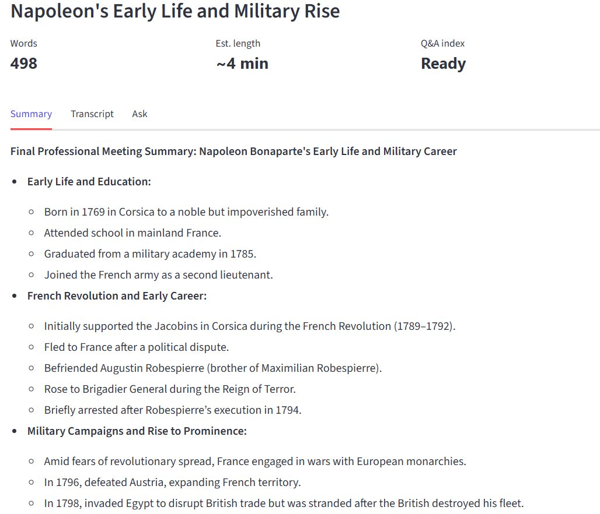
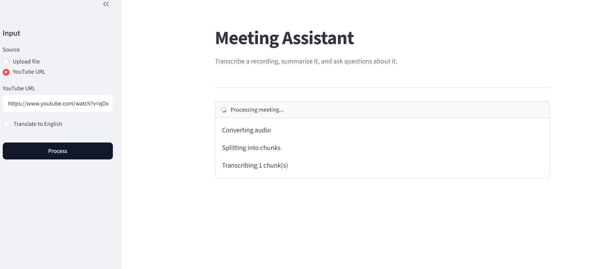
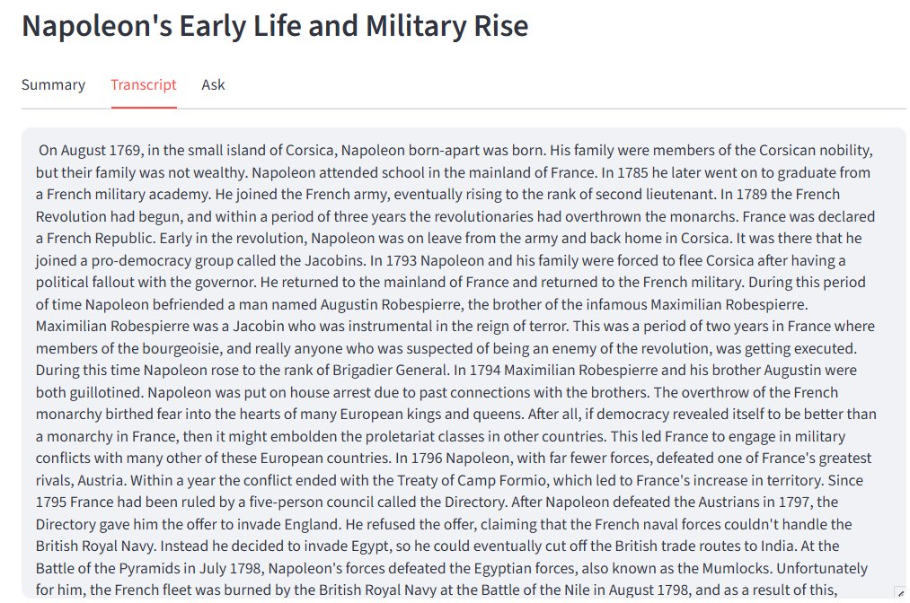
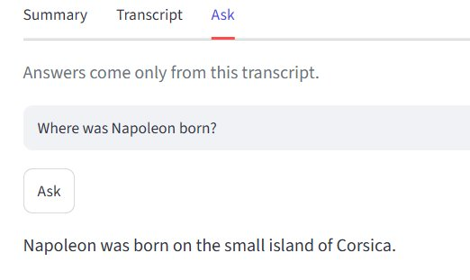
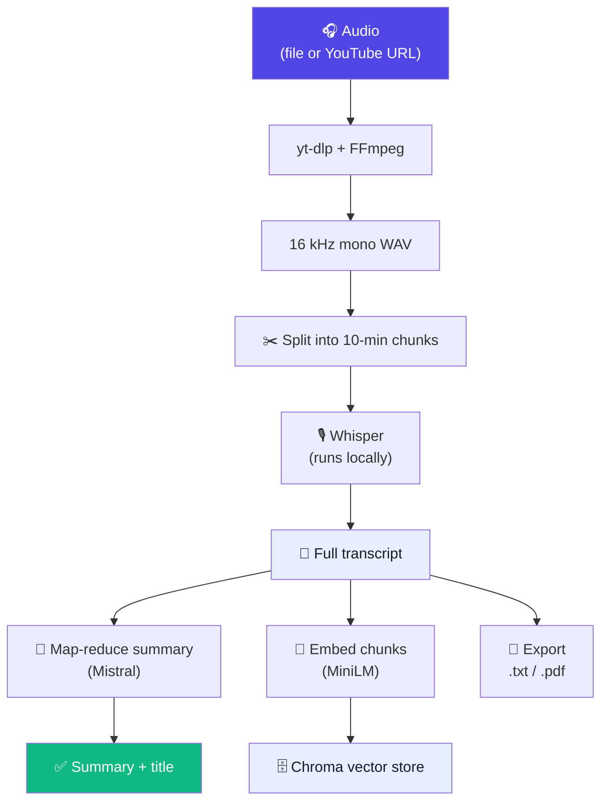
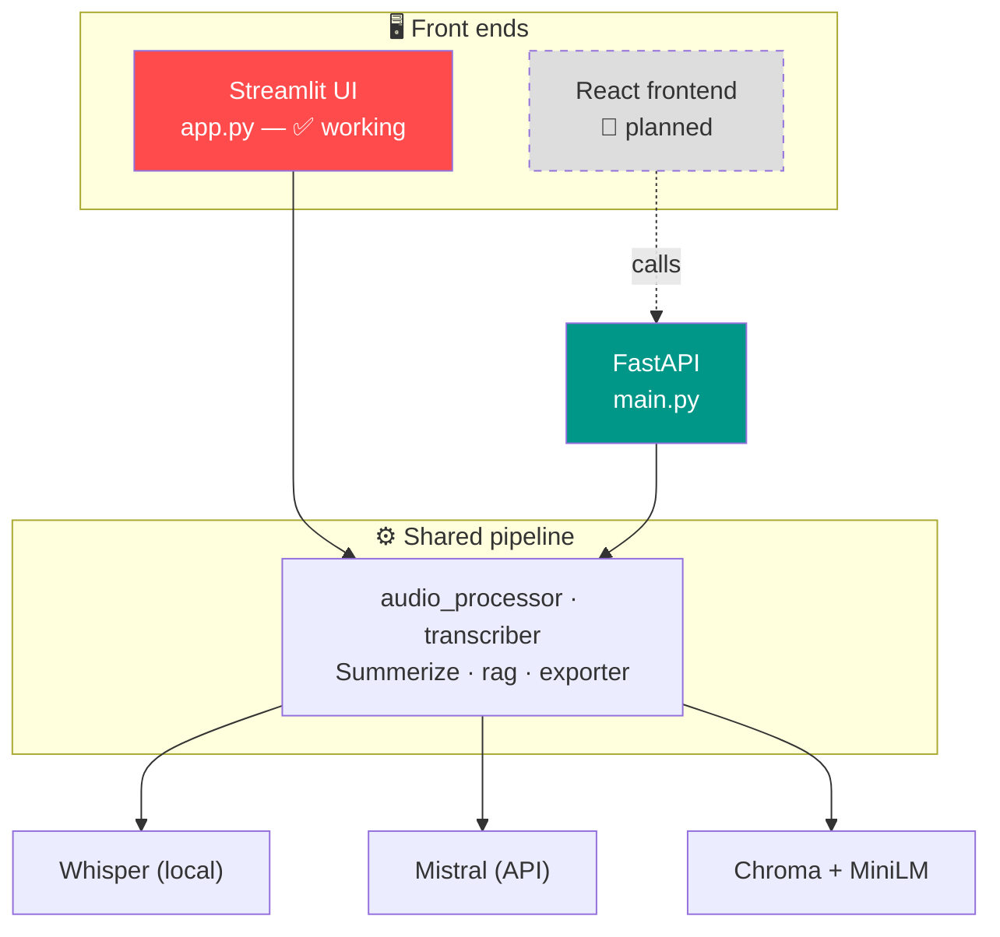

<div align="center">

# 🎙️ Meeting Assistant

**Drop in a recording — get back a summary, a full transcript, and an AI you can ask questions about what was said.**

Transcription runs locally on your machine. Answers are grounded in the transcript, so it doesn't make things up.




</div>

---

## ✨ What it does

Give it audio and it runs a five-step pipeline, end to end:

| Step | What happens |
|------|--------------|
| 🎧 **Acquire** | Downloads audio from a YouTube link, or takes a file you upload. |
| 📝 **Transcribe** | Runs **OpenAI Whisper locally** — your audio never leaves your machine. Optional *translate* mode turns non-English audio into English. |
| 🧠 **Summarize** | A **map-reduce** pass with Mistral produces a structured summary and a title. |
| 🔎 **Index** | The transcript is embedded and stored in a **vector database** so it can be searched by meaning. |
| 💬 **Ask** | Questions are answered using **only** the relevant parts of the transcript — grounded, not guessed. |

Results export to **`.txt`** or **`.pdf`**.

---

## 🖼️ Screenshots

| Interface | Transcript | Ask (Q&A) |
|-----------|-----------|-----------|
|  |  |  |

---

## 🏗️ How it works — the pipeline

Everything flows from one recording. The transcript is the hub: it feeds the summary, the searchable index, and the export.



### The Q&A part (RAG — Retrieval-Augmented Generation)

This is what keeps answers honest. Instead of dumping the whole transcript into the model and hoping, only the **most relevant chunks** are retrieved and passed to Mistral — with an instruction to say *"not in the transcript"* rather than invent an answer.


> **Why two different models?** A local `all-MiniLM-L6-v2` model turns text into vectors *for search*. **Mistral** does the actual *writing* — summaries and answers. Chroma only stores vectors and finds the nearest ones; it doesn't generate anything.

---

## 🧩 Two ways to run it

The project has a **working Streamlit app** and a **FastAPI backend** built on the *same* pipeline. Streamlit is the finished UI; FastAPI is the foundation for a future custom (React) frontend.



- **Streamlit** (`app.py`) — the full graphical app. Run it and use it in your browser.
- **FastAPI** (`main.py`) — an HTTP API (`/transcribe`, `/jobs/{id}`, `/ask`, `/export`) that runs transcription as a **background job** and reports progress via polling. Test it at `/docs`.

---

## 🛠️ Tech stack

| Layer | Tool |
|-------|------|
| Audio | yt-dlp, pydub, FFmpeg |
| Transcription | OpenAI Whisper (local), PyTorch |
| Summary & Q&A | Mistral (`mistral-small-latest`) via LangChain |
| Retrieval (RAG) | sentence-transformers embeddings, Chroma |
| Web UI | Streamlit |
| Web API | FastAPI, Uvicorn |
| Export | fpdf2 |

---

## 📂 Project structure

```
app.py              Streamlit UI + pipeline orchestration  (the working app)
main.py             FastAPI backend  (HTTP API over the same pipeline)
audio_processor.py  download / convert / chunk audio
transcriber.py      Whisper transcription (with translate option)
Summerize.py        map-reduce summary + title generation
rag.py              embed → store → retrieve → answer
exporter.py         .txt and .pdf export
requirements.txt    Python dependencies
```

---

## 🚀 Getting started

### 1. Prerequisites

- **Python 3.11** (newer versions currently fight with the Whisper/PyTorch wheels on Windows)
- **FFmpeg** (a separate binary — `pip` won't install it):

  ```bash
  # Windows
  winget install Gyan.FFmpeg
  # macOS
  brew install ffmpeg
  # Linux
  sudo apt install ffmpeg
  ```

### 2. Install

```bash
git clone https://github.com/Pandeyycodes/<your-repo>.git
cd <your-repo>

python -m venv .venv
# Windows:      .venv\Scripts\activate
# macOS/Linux:  source .venv/bin/activate

pip install -r requirements.txt
```

> The first run downloads the Whisper model and the embedding model (~80 MB), so give it a minute. After that they're cached.

### 3. Configure your API key

Copy `.env.example` to `.env` and add a free Mistral key from [console.mistral.ai](https://console.mistral.ai):

```env
MISTRAL_API_KEY=your_key_here
WHISPER_MODEL=small
```

> Transcription runs **without** a key. Only the summary and Q&A steps need it.
> `.env` is gitignored — your key never goes near the repo.

### 4. Run it

**Option A — the Streamlit app (recommended):**

```bash
streamlit run app.py
```

Then open the local URL it prints (usually `http://localhost:8501`).

**Option B — the FastAPI backend:**

```bash
uvicorn main:app --reload
```

Then open `http://localhost:8000/docs` to try the endpoints in your browser.

---

## 🔧 Making changes — where to edit what

Want to tweak something? Here's the map:

| I want to… | Edit | Look for |
|------------|------|----------|
| Change Whisper accuracy/speed | `.env` | `WHISPER_MODEL` (`tiny` → `large`) |
| Change chunk length | `audio_processor.py` | `chunk_audio(..., chunk_minutes=10)` |
| Change how the summary reads | `Summerize.py` | the `system` prompts |
| Change the Q&A behavior | `rag.py` | the `ChatPromptTemplate` + `search_kwargs={"k": 4}` |
| Swap the LLM | `rag.py` / `Summerize.py` | `get_llm()` |
| Change the UI look | `app.py` | the `st.markdown("<style>…")` block |
| Add an API endpoint | `main.py` | the `@app.get/post` routes |
| Change export formatting | `exporter.py` | `export_txt` / `export_pdf` |

**`WHISPER_MODEL` trades speed for accuracy:** `tiny`/`base` are fast, `small` is a good balance, `medium`/`large` are slower but more accurate.

---

## ⚠️ Limitations

Deliberate trade-offs for a project (not a production service):

- **Whisper runs on CPU by default** → long recordings transcribe slowly. A CUDA build of PyTorch speeds this up a lot.
- **The FastAPI job store is in-memory** → a server restart forgets jobs. Production would use Redis or a database.
- **PDF export handles English well**, but not Devanagari/Hindi without adding a Unicode font. The `.txt` export keeps everything.
- **YouTube extraction depends on yt-dlp** keeping up with YouTube's changes; file upload is the reliable path.

---

## 🗺️ Roadmap

- [ ] React/Next.js frontend on top of the FastAPI backend
- [ ] Persist and search across **multiple** past meetings
- [ ] Speaker diarization ("who said what")
- [ ] Swap Whisper-translate for a dedicated translation API

---

## 📄 License

[MIT](LICENSE) — free to use, modify, and share.
